## Task01

#### Steps

1. Use the command `printenv` and `env` to show all of the environment variables.
    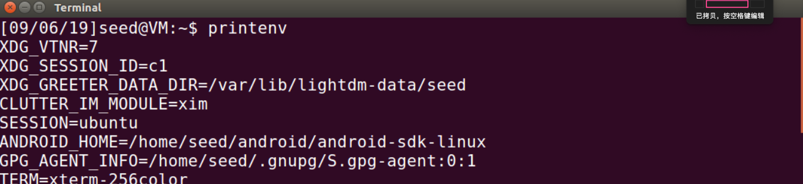
    
2. Use the command `printenv PWD` or `env | grep PWD` to output the exact environment variable.
    
    
3. Use the `export` to set an environment variable called `envv`, whose value is `123test`. 
    

4. Use the `unset` to unset the env variable.
    

5. Set variable `aaa` with or without using `export` command.
6. Use `env` and `echo` command to check those two variables.
7. Use `strings /proc/$$/environ | grep aaa` to get `aaa` from the current environment variables.
    
    **result:**
    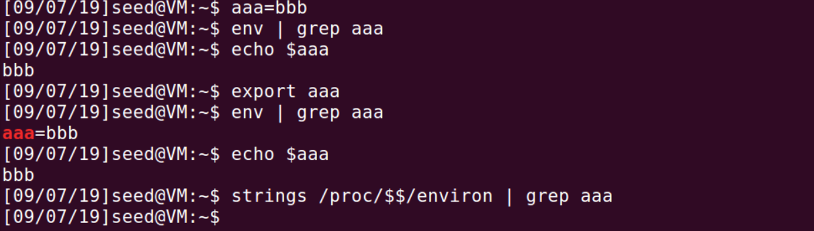
    

#### Explanation

- The `env` command

   If we use the `env` command, the current shell process would create a child process and excute the `env` command. So the output would be environment variables of child process which clearly inherited from parent shell. 

- The `$`

   If we use `$` before a word, shell would recognize the word as a shell variable.
    
So if we use the `key=value` form to set a variable, it would become a shell variable and only worked in this shell process. But if we use `export` before that variable, it would be passed to the child process as an environment variable.

Why I can use the `$` to get an environment variable? Because the shell will copy all of its environment variables it inherits as shell variable while it is created.

#### About the `/proc/$$/environ`

**why I use `/proc/$$/environ` to get the variable that I just set using `export`, then I get nothing?** 

> Because the environ file contains the environment as it looked when the process was spawned. That means that any changes the process might have made to its environment will not be visible in /proc.

Picture in the page 31 of the book *Computer & Internet Security* is visually showing this.

## Task 02

#### Steps

1. Compile and run the program provided by the instruction book. Redirect their out put into two files, `child_env` and `parent_env`.
2. Use `diff` command to check the result.
    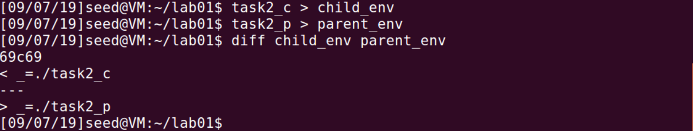
   
3. Set `aaa=bbb` and `ccc=ddd` in parent process, one use `export` and the another do not. Then rerun the child programs(`task2_c`).
    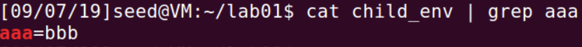

#### Conclusion
 
The output of parent and child are excatly the same, which means the environment variables of parent are fully inherited by the child, including the variable just set by `export`.

#### About the fork()

1. Use `man fork` to figure out what is the `fork` function.

    > **fork()**  creates  a new process by duplicating the calling process.  The new process is referred to as the child process.  The  calling  process is referred to as the parent process.

    > **Things are not inherited by the child process:**
    > * The child has its own unique process ID. And its parent PID is the same as the parent process ID.
    > * The child process does not inherits its parent's memory locks, and the process resource utilizations and the CPU time counters are reset to zero in the child.
    > * The pening signals of child is initially empty.
    > * The child does not inherits the semaphore adjustment or the process-associated record locks from its parents.
    > * The setitimer, alarm , timer_create are also not be inherited.
    > * Outstanding asynchronous I/O operations are not be inherited.

    > **The returns:**
    > On success, the PID of the child process is returned in the parent, and 0 is returned in the child.  On failure, -1 is returned in the  parent, no child process is created, and errno is set appropriately.

2. Write a program to test it.

```c
#include <unistd.h>
#include <stdio.h>
#include <stdlib.h>

void main()
{
	pid_t childPid;
	childPid = fork();
	if(childPid == 0) {
		 /* child process */
		printf("Child:child PID: %d\nChild:parent PID: %d\nChild:childPid: %d\n", getpid(),getppid(),childPid); 
	}else{ /* parent process */		
		printf("Parent:current PID=%d\nParent:childpid=%d\n",getpid(),childPid);
	}
	exit(0);
}
```

**result:**
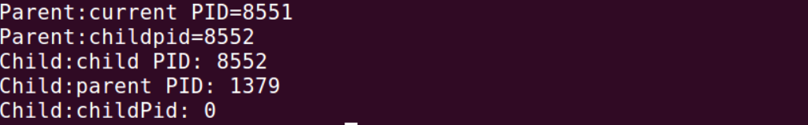

Clearly, the `fork()` function returns the `child process id` to the parent process and `0` to the child process. But why the PID of parent process is not as same as the parent PID of the child?
 
I guess it is due to the parent process might ended before the execution of getpid() in child program. So the child process has become the child process of the ancestor process.

3. I add sleep function to this program to extend the execution time for testing this. And it works. 
    `sleep(3)`
    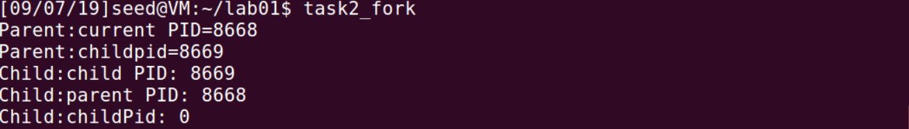
    
## Task03

#### Steps

1. Compile and run the program; The output is as the following image:
    

2. Change the invocation of `execve()` by passing the `environ` to it; The result is as the following image:
    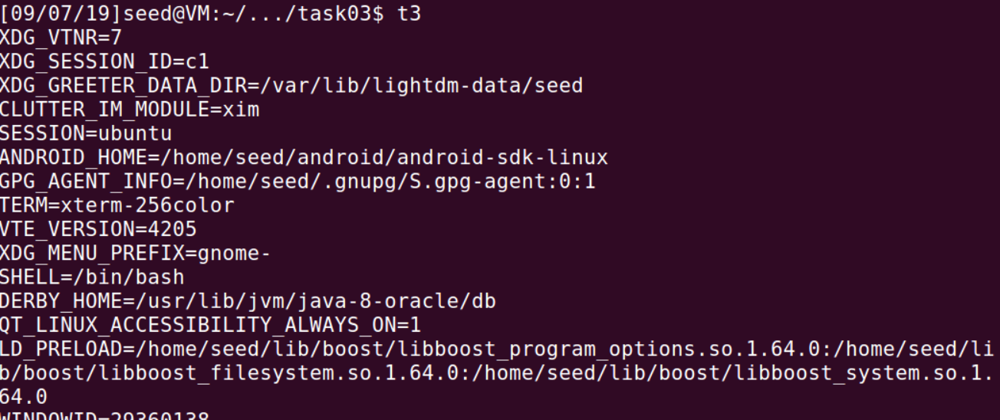
    
#### Conclusion

Once we run a new program, the process will use `execve` to run the program and pass part of its shell variables, including the environment variable and the exported shell variables, as the third parameter of `execve` to the new program.

If the program needs to operate the environment variables, the global variable `environ` will be used in the program, which is a pointer that points to the environment variables that inherited from the parent process and the new exported shell variables. 

## Task04

#### Steps

1. Export a variable `ccc=123`. 
2. Compile and run the program.
3. Found the ccc in the out put of the program, so as other environment variables.
    

#### Conclusion

The variable exported in the parent process, and passed to the new program (t4) and continue passed to the process which created by the `system()` function. And it will be introduced as the third parameter of the `execve` function, then out put by `/usr/bin/env`. 

## Task05

#### Steps

1. Write the program as the instruction book told.
2. Make the program a Set_UID program.
3. Use the export command to set three environment variabels: PATH, LD_LIBRARY_PATH, MYENV
    **PATH**
    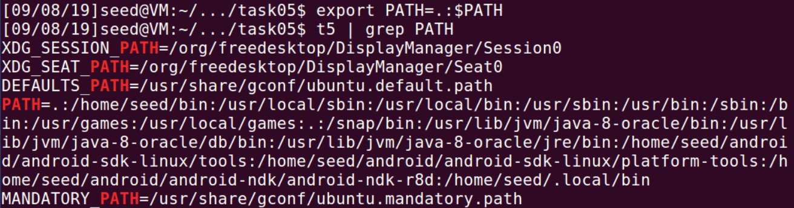
    **LD_LIBRARY_PATH**
    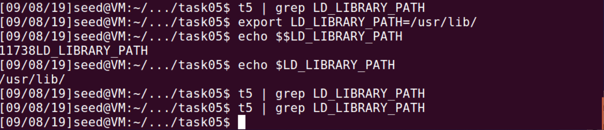
    **MYENV**
    
    
#### Result

* For the `PATH` variable, which originally exist, its value can be change, and the changed value can be passed to the Set-UID program. It means the Set-UID program will use the environment variable `PATH` that updated by normal users， which will be dangerous.
* For the `LD_LIBRARY_PATH` variable, which not exist at the time, cannot be set as environment variable nor passed to Set-UID program.
* For the `MYENV`, which is the environment variable that created by me, can be passed to the Set-UID program.

The environment variable `LD_LIBRARY_PATH` cannot be changed and passed to the Set-UID program really surprised me. 


## Task06

#### Steps & Observation

1. Add the directory `.` to the `PATH` variable.
    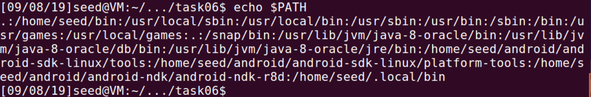
2. Create a program called `t6` and upgrade it to Set-UID program.
    
3. Create a program called `ls` in the current path. The code is showing below:
    
```c
    #include <stdio.h>
    #include <unistd.h>

    int main(){
        printf("This is a user design program. The euid=%d,ruid=%d\n",geteuid(),getuid());
        system("mkdir /ttttt");
    return 0;
    }
```
    
4. Run `t6`. Found that the euid is not `0`.
5. Link the `/bin/sh` to the `/bin/zsh`.
6. Try steps above again.
    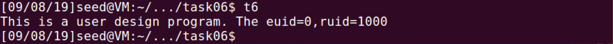
    
    The euid now is `0`, which means that my program are running in root previlege.
    
    
## Task07

#### Steps

1. Create a program and named it `mylib.c` which only contains a function called `sleep` and will just print something while called.
```c
    #include <stdio.h>
    void sleep (int s)
    {
      /* If this is invoked by a privileged program,
         you can do damages here!  */
      printf("I am not sleeping!\n");
    }
```
2. Compile this program to a dynamic link library and set the `LD_PRELOAD` with its path.
    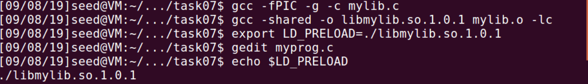
    
3. Write a program nam'ed `myprog` to call the `sleep` function.
```c
    /* myprog.c */
    int main()
    {
        sleep(1);
        return 0; 
    }
```
4. Run the `myprog` in these condition listed below:
    * Make myprog a regular program, and run it as a normal user.
    
    * Make myprog a Set-UID root program, and run it as a normal user.
    **It sleeps for a second.**
    
    * Make myprog a Set-UID root program, export the LD_PRELOAD environment variable again in the root account and run it.
    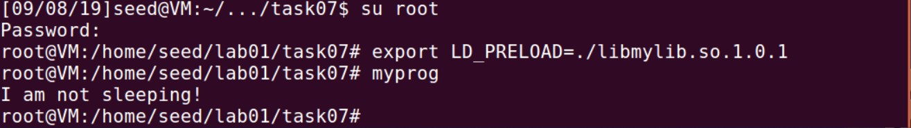
    * Make myprog a Set-UID user1 program (i.e., the owner is user1, which is another user account), export the LD_PRELOAD environment variable again in a different user’s account (not-root user) and run it.
    **Let the program a Set-UID program for `user1` and export the `LD|_PRELOAD` with seed account. The result:**
    
    
    

#### Experiment

1. I add some code in the program(`myprog`) to print out the environment variables, and recompile it to (`se_myprog`):
```c
    #include <stdio.h>
    #include <stdlib.h>
    #include <string.h>

    extern char **environ;

    void print_env()
    {
        int i = 0;
        while (environ[i] != NULL) {
                printf("%s\n", environ[i]);
            i++;
        }
    }

    int main()
    {
        print_env();
        sleep(1);
        return 0; 
    }
```

2. I change this program (`se_myprog`) to a Set-UID program of `user1`. Then use `seed` to export the `LD_PRELOAD` and run it. And check out if the `LD_PRELOAD` is in the new process and has the same value as exported before.
    
    
3. Run this program by `user1`, which is the owner of this program. It works.
    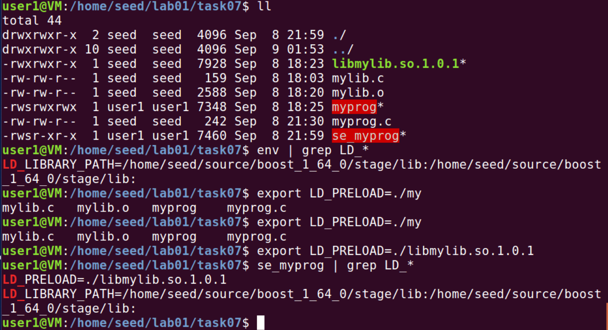

4. I change the owner of Set-UID program from `user1` to `root`, and repeat the step-2.
    

5. Change the Set-UID program to a normal program. Then repeat the export operation and run it.
    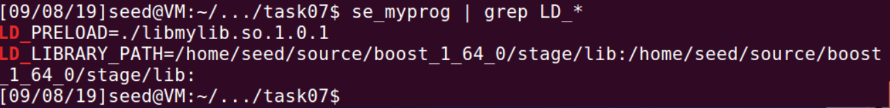

#### Conclusion

From the experiment, we can drow a conclusion. If the program is a Set-UID program and the ruid is unequal with the euid, the child process will not inherit the `LD_*`, but for a normal program or a Set-UID program which has the same euid and ruid, it will.

## Task08

#### Steps

1. Compile and upgrade the program named(`sys_t8`), which is user `system` function to invoke a command, to a Set-UID program of root.
2. Create a file named `testfile` with root identity under the path `/`. And write the sentence `"only root can modify and see it"`.
    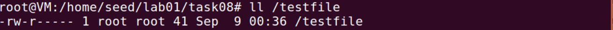    
3. Try to run `sys_t8` with the argument: 
    * `sys_t8 "/testfile"`
    * `sys_t8 "/testfile;rm /testfile"`
    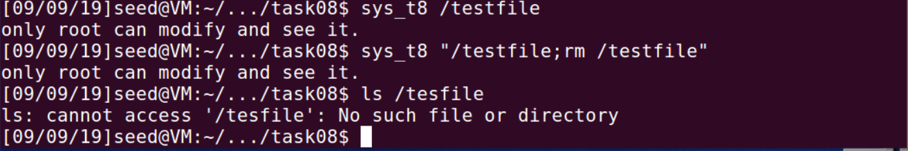

4. Comment the line of `system()` in the program and uncomment the `execve()` statement, and compile to the executable file named `exe_t8`. Then repeat the step 1-3.
    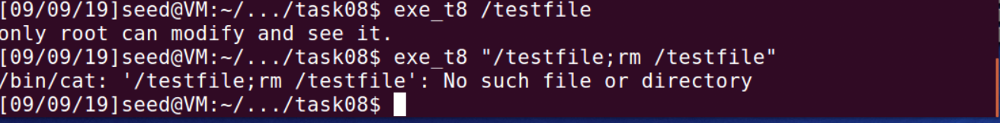
    
#### Explanation

The `system()` will create a new shell, and ask the shell to execute the command. So the `sys_t8 "/testfile;rm /testfile"` will be treated as two command. One is `sys_t8 /testfile` and the other is `rm /testfile`. 

But if we use the `execve()` to execute a command, like `exe_t8 "/testfile;rm /testfile"`, it will treat the whole things behind `exe_t8` as a parameter. So it will print `cannot find file "/testfile;rm /testfile"`.

## Task09

#### Steps
1. Create the `/etc/zzz` with root identity, and give it permission 0644.
2. Compile and run the program.
    
    The `/etc/zzz` has been modified.

#### Expanation

The program is simulating a situation in which a Set-UID program use `root` privilege to create a file descriptor and use the `fork()` function to create a child process.

However, the the `fork()` will duplicating the calling process, which means the file discripter will also existt in the child process. So, even if the identity is downgrade to normal user before the `fork()`, the child process still can use the file descriptor to modify the file.